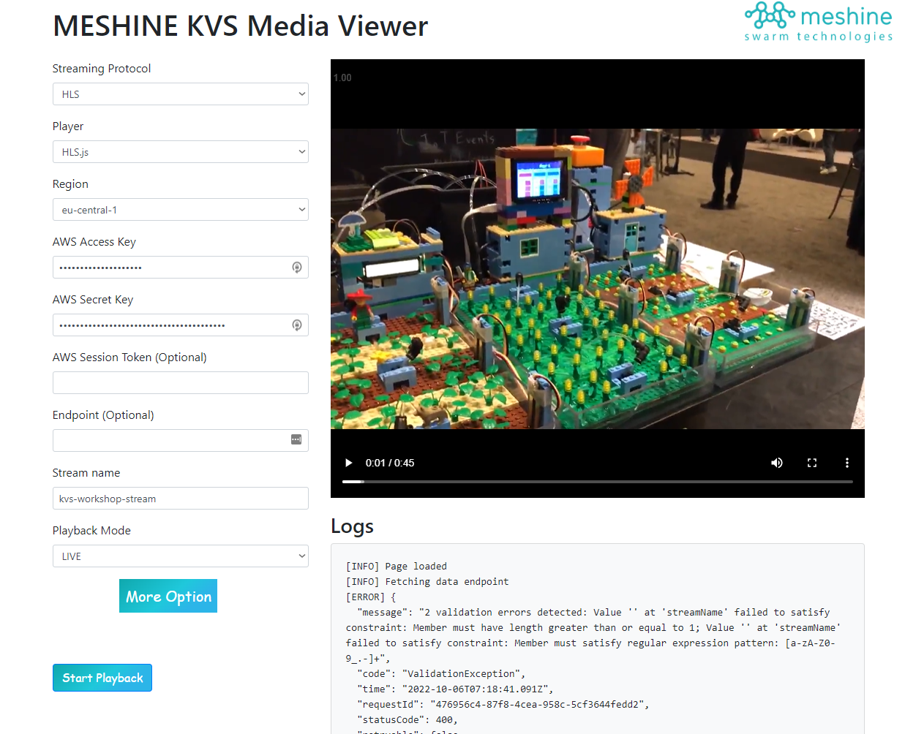

##  Meshine KVS Media Viewer

Easily view HLS and MPEG-DASH output of Meshine Kinesis Video Streams
* * *
## About
This is a simple static webpage that simplifies testing and experiments with HLS and MPEG-DASH output from Amazon Kinesis Video Streams. This is based on the <a href="https://docs.aws.amazon.com/kinesisvideostreams/latest/dg/how-hls.html">documentation</a>.

## Getting Started
The easiest and recommended approach is to use the Github-hosted version of this project. The second method is to clone/download this project and host it in your own S3 bucket or even locally.

### Using the Github-hosted UI
Because the project is a collection of static HTML and JavaScript, you can use the application without deploying the code into your own AWS account.

To get started, go to the hosted [MESHINE KVS Media Viewer](https://burak-meshine.github.io/meshine-kvs-media-viewer/).

 

## License Summary

This sample code is made available under a modified MIT license. See the LICENSE file.
